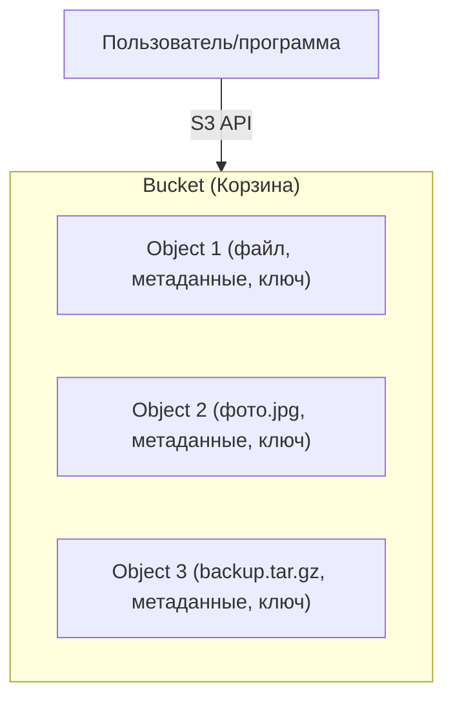
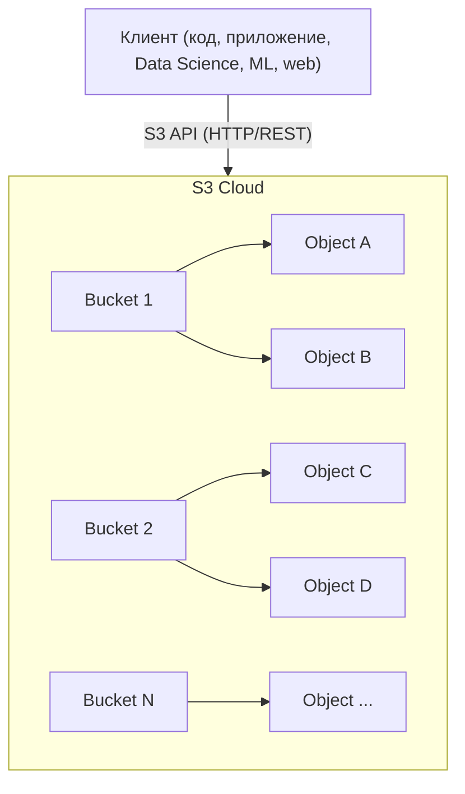
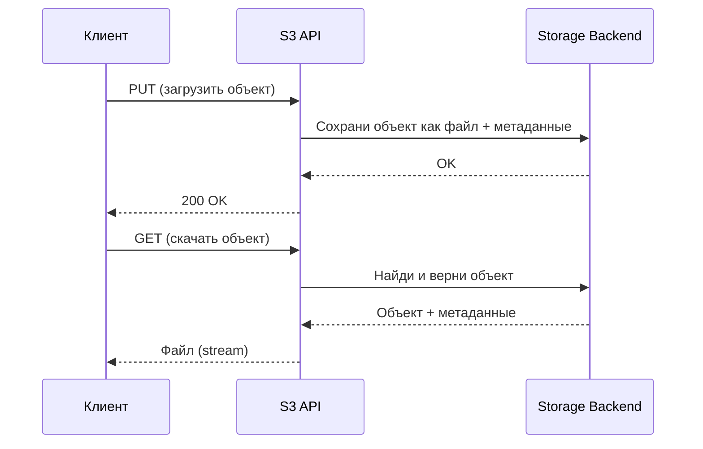

# S3 как стандарт

## Создание виртуального окружения

```bash
python3.12 -m venv venv && \
source venv/bin/activate && \
pip install --upgrade pip && \
pip install poetry && \
poetry lock && \
poetry install
```

### Добавление новых зависимостей в окружение

```bash
poetry lock && \
poetry install
```

### Добавление зависимости в pyproject.toml

```bash
poetry add <package_name>=<version>
```

## Разворачивание инфраструктуры

```bash
docker-compose up -d
```

## Получение файла для загрузки в S3

Выполнить в корне проекта:

```bash
curl -LfO https://raw.githubusercontent.com/datasciencedojo/datasets/master/titanic.csv 
```

## Что такое объектное хранилище и S3?

### Классические типы хранения

- **Файловое хранилище** (File Storage):
    - Файлы хранятся в папках и подчиняются файловой структуре (например, папка/файл.txt).
    - Хорошо подходит для мелких файлов, домашнего использования и рабочих станций.
- **Блочное хранилище** (Block Storage):
    - Данные разбиты на блоки фиксированного размера (например, жёсткий диск, SSD, iSCSI).
    - Используется для баз данных, виртуальных машин, когда важна скорость.
- **Объектное хранилище** (Object Storage):
    - Данные хранятся в виде "*объектов*".
    - Каждый `объект` = `файл` + `метаданные` + `уникальный ключ` (имя/идентификатор).
    - Структуры папок нет, есть "бакеты" (buckets), как большие контейнеры.

### Что такое S3?

- **S3 (Simple Storage Service)** — сервис для объектного хранения.
- S3 – это стандарт де-факто для облачного хранения больших объёмов данных:
    - Логи, резервные копии, большие датасеты, фото и видеоархивы, data lake.
- **S3 API** – набор стандартных HTTP-запросов для работы с объектами (`PUT`, `GET`, `DELETE` и т.п.).
- Идея S3 скопирована и реализована многими облаками: MinIO, Selectel, VK Cloud, Yandex Cloud, Google Cloud Storage,
  etc.

### Как устроено объектное хранилище?



- **Bucket** — контейнер для объектов (можно представить как папку верхнего уровня).
- **Object** — любые данные (файл), которые хранятся внутри bucket.
- **Метаданные** — информация о файле (дата, тип, кастомные теги и пр.).
- **Ключ (key)** — уникальное имя объекта внутри bucket (например, `2024/photos/image1.jpg`).

### Ключевые особенности объектного хранилища

- Нет реальной древовидной файловой структуры (всё хранится "*плоско*", но ключи могут имитировать пути).
- Масштабируется до триллионов объектов.
- Дешёвое и надёжное хранение.
- Хорошо подходит для:
    - Data Lake
    - Backup
    - Big Data
    - Архивов
    - ML/DL задач.
- Доступ по интернету (REST API / S3 API).

### Почему S3 так популярен?

- **Открытый стандарт** — легко мигрировать между разными облаками и on-premises.
- **Масштабируемость** и высокая доступность.
- **Гибкая настройка доступа** (IAM, политики, временные ссылки).
- **Поддержка большого числа инструментов и библиотек** (pandas, boto3, minio-py, s3cmd и др).

### Общая архитектура



### Ключевые элементы архитектуры

- **Бакеты (Buckets):**
    - Логические контейнеры для хранения объектов.
    - В каждом бакете могут быть миллионы и даже миллиарды объектов.
    - Название бакета уникально в пределах облака.
- **Объекты (Objects):**
    - Каждый объект — это файл + метаданные + уникальный ключ (имя, например: `data/2024/report.csv`).
    - В отличие от файловых систем, нет реальных папок — только имитация через ключи.
- **S3 API (REST/HTTP):**
    - Вся работа с хранилищем происходит через стандартные HTTP-запросы: `PUT`, `GET`, `DELETE`, `LIST` и др.
    - Всё, что нужно — это `endpoint`, ключи доступа, имя бакета и имя объекта.

### Как выглядит взаимодействие

1. **Клиент (ваш код, pandas, boto3, minio-py, ML pipeline)**  
   → Отправляет запрос (например, загрузить файл или получить список объектов).
2. **S3 Gateway (front, API endpoint)**  
   → Получает запрос, авторизует и аутентифицирует пользователя (по ключам).
3. **Storage Backend**  
   → Физически хранит объекты (диски, кластер серверов, репликация, шардирование).
4. **Ответ клиенту**  
   → Возвращает результат (файл, статус, список объектов и т.д.).



### Как обеспечивается надёжность

- **Репликация:** Данные автоматически копируются на несколько серверов или даже в разные дата-центры.
- **Версионирование:** Можно включить хранение всех версий файла.
- **Политики доступа и шифрование:** Доступ через IAM, ACL, шифрование «на лету» и «на диске».

### Demo

1) Показать какие бакеты есть и показать, что оба клиента работают успешно для всех S3 – `list_bucket.py`
2) Показать, что все бакеты пустые и там нет объектов – `list_objects.py`
3) Положить файл c данными титаника в S3 бакеты – `upload_object.py`
4) Показать, что в бакетах появились объекты – `list_objects.py`
5) Создать и удалить бакеты – `create_remove_bucket.py`
6) Создать бакеты – `create_bucket.py`
7) Показать текущие бакеты - `list_bucket.py`
8) Загрузить данные при помощи DuckDB – `duckdb_copy_to_s3.py`
9) Прочитать данные при помощи DuckDB – `duckdb_read_from_s3.py`
10) Загрузить данные при помощи Pandas – `pandas_dataframe_to_s3.py`
11) Прочитать данные при помощи Pandas – `pandas_dataframe_from_s3.py`
12) Показать, что всё что мы писали есть в бакетах – `list_objects.py`


